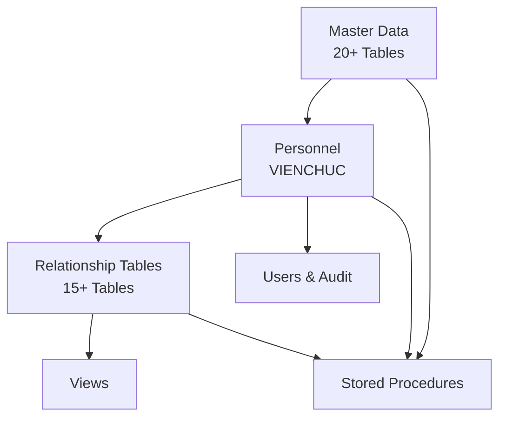
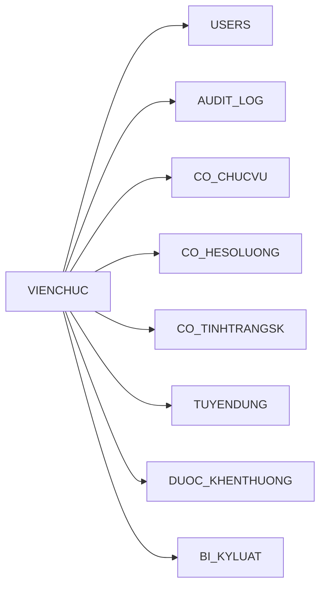
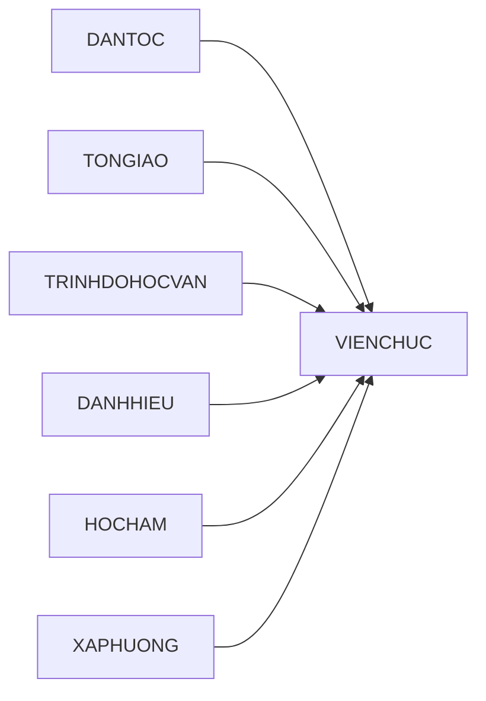
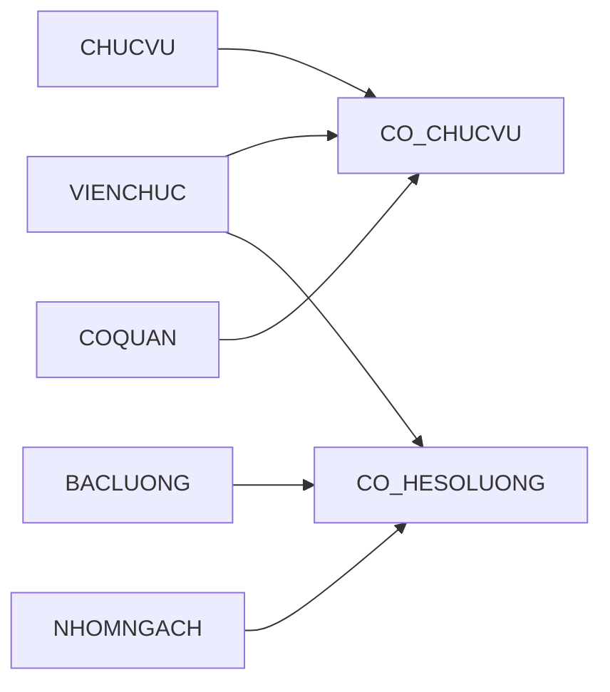
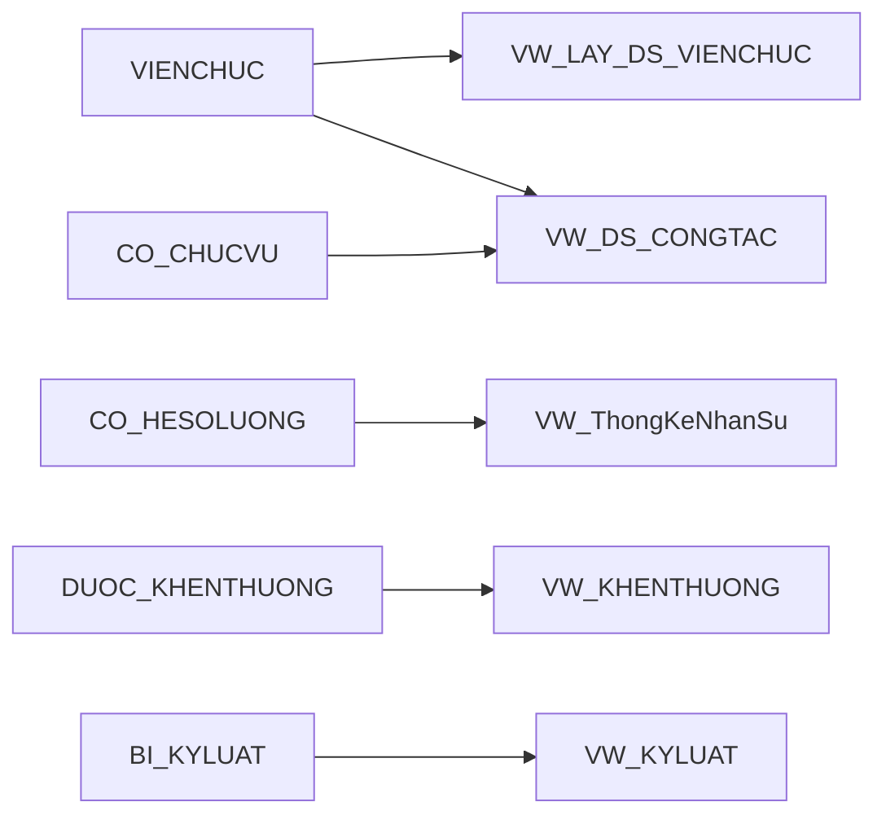
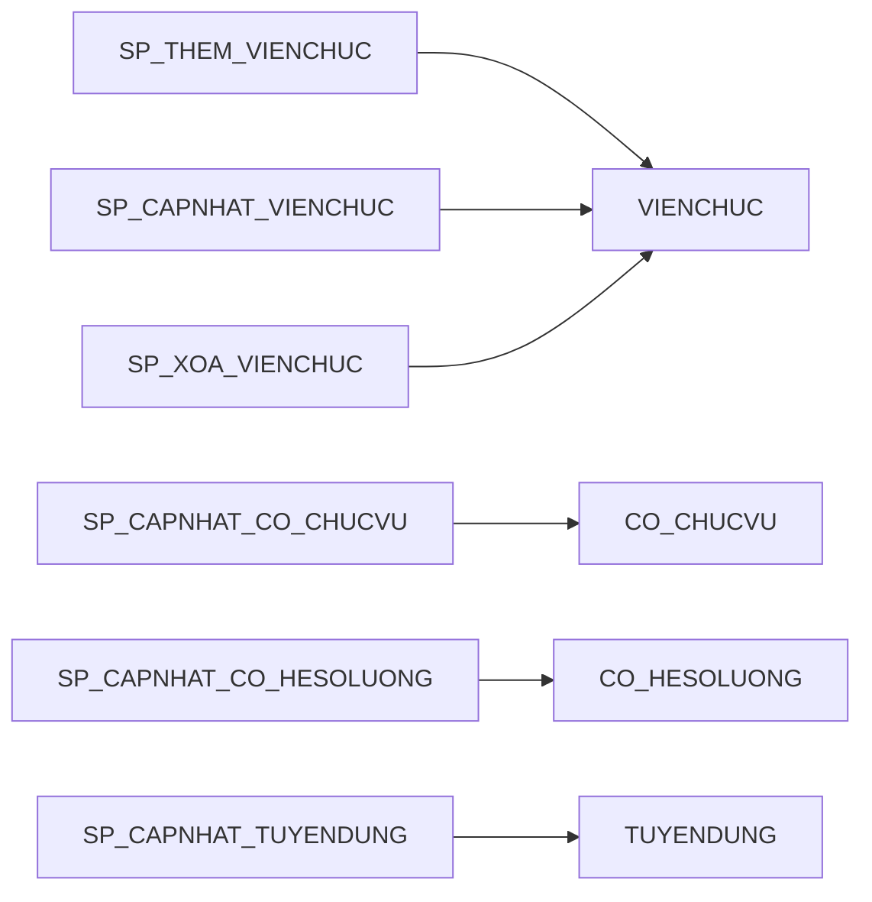

# Database Object Map

This document maps the database objects in this project and shows how they depend on each other.

## Database Architecture Diagram

### 1. Core Entity Model

### 2. Master Data Dependencies

### 3. Personnel Relationships

### 4. Reporting Layer

### 5. Procedures Layers

## What Depends On What

`VIENCHUC` is the central table. Most relationship tables point to it with foreign keys, and the reporting views read from it directly or through those relationship tables.

The procedures mainly do one of three things:

1. Insert or update rows in `VIENCHUC` and `USERS`.
2. Insert or delete rows in relationship tables such as `CO_CHUCVU`, `THUOC_QUANDOI`, and `DUOC_KHENTHUONG`.
3. Wrap multi-step changes in a transaction so the application can change related rows together.

The triggers enforce business rules on insert/update and write audit rows for `VIENCHUC` changes.

## View Overview

| Type | Name | Depends On | Purpose |
| --- | --- | --- | --- |
| View | VW_LAY_DS_VIENCHUC | VIENCHUC, DANTOC, TONGIAO, TRINHDOHOCVAN, CO_CHUCVU, COQUAN, CHUCVU | Full employee profile listing |
| View | VW_DS_CONGTAC | CO_CHUCVU, VIENCHUC, CHUCVU, COQUAN, CHUCDANH_NGHENGHIEP | Current work / assignment information |
| View | VW_ThongKeNhanSu | VIENCHUC, DANTOC, TONGIAO, CO_CHUCVU, COQUAN | Employee statistics by unit, gender, ethnicity, religion |
| View | VW_KHENTHUONG | DUOC_KHENTHUONG, VIENCHUC, HINHTHUCKHENTHUONG | Reward history |
| View | VW_KYLUAT | BI_KYLUAT, VIENCHUC, HINHTHUCKYLUAT | Discipline history |

## Stored Procedure Overview

| Type | Name | Depends On | Notes |
| --- | --- | --- | --- |
| SP | SP_THEM_USERS | USERS | Creates app user, grants database role |
| SP | SP_THEM_VIENCHUC | VIENCHUC, USERS, SP_THEM_USERS | Creates employee and matching app user in one transaction |
| SP | SP_CAPNHAT_USERS | USERS | Updates role and database grants |
| SP | SP_XOA_USERS | USERS | Drops database user and deletes app row |
| SP | SP_CAPNHAT_VIENCHUC | VIENCHUC, USERS, SP_CAPNHAT_USERS | Updates employee and user role together |
| SP | SP_XOA_VIENCHUC | VIENCHUC, USERS, SP_XOA_USERS | Deletes user first, then employee |
| SP | SP_CAPNHAT_DUOC_KHENTHUONG | DUOC_KHENTHUONG | Upsert reward record |
| SP | SP_XOA_DUOC_KHENTHUONG | DUOC_KHENTHUONG | Delete reward record |
| SP | SP_CAPNHAT_BI_KYLUAT | BI_KYLUAT | Upsert discipline record |
| SP | SP_XOA_BI_KYLUAT | BI_KYLUAT | Delete discipline record |
| SP | SP_CAPNHAT_CO_CAPLYLUANCHINHTRI | CO_CAPLYLUANCHINHTRI | Upsert political theory level relation |
| SP | SP_XOA_CO_CAPLYLUANCHINHTRI | CO_CAPLYLUANCHINHTRI | Delete relation |
| SP | SP_CAPNHAT_CO_CAPQUANLYNHANUOC | CO_CAPQUANLYNHANUOC | Upsert state management level relation |
| SP | SP_XOA_CO_CAPQUANLYNHANUOC | CO_CAPQUANLYNHANUOC | Delete relation |
| SP | SP_CAPNHAT_CO_CHUCVU | CO_CHUCVU | Upsert position assignment |
| SP | SP_XOA_CO_CHUCVU | CO_CHUCVU | Delete position assignment |
| SP | SP_CAPNHAT_CO_HESOLUONG | CO_HESOLUONG | Upsert salary coefficient relation |
| SP | SP_XOA_CO_HESOLUONG | CO_HESOLUONG | Delete salary coefficient relation |
| SP | SP_CAPNHAT_CO_HOKHAUTHUONGTRU | CO_HOKHAUTHUONGTRU | Upsert permanent residence relation |
| SP | SP_XOA_CO_HOKHAUTHUONGTRU | CO_HOKHAUTHUONGTRU | Delete permanent residence relation |
| SP | SP_CAPNHAT_CO_TAMTRU | CO_TAMTRU | Upsert temporary residence relation |
| SP | SP_XOA_CO_TAMTRU | CO_TAMTRU | Delete temporary residence relation |
| SP | SP_CAPNHAT_CO_TINHTRANGSK | CO_TINHTRANGSK | Upsert health status relation |
| SP | SP_XOA_CO_TINHTRANGSK | CO_TINHTRANGSK | Delete health status relation |
| SP | SP_CAPNHAT_CO_TRDCM_CAONHAT | CO_TRDCM_CAONHAT | Upsert highest professional qualification relation |
| SP | SP_XOA_CO_TRDCM_CAONHAT | CO_TRDCM_CAONHAT | Delete relation |
| SP | SP_CAPNHAT_CO_TRD_NGOAINGU | CO_TRD_NGOAINGU | Upsert foreign language qualification relation |
| SP | SP_XOA_CO_TRD_NGOAINGU | CO_TRD_NGOAINGU | Delete relation |
| SP | SP_CAPNHAT_CO_TRD_TINHOC | CO_TRD_TINHOC | Upsert computer certificate relation |
| SP | SP_XOA_CO_TRD_TINHOC | CO_TRD_TINHOC | Delete relation |
| SP | SP_CAPNHAT_THUOC_QUANDOI | THUOC_QUANDOI | Upsert military service relation |
| SP | SP_XOA_THUOC_QUANDOI | THUOC_QUANDOI | Delete military service relation |
| SP | SP_CAPNHAT_THUOC_TCDT_CTXH | THUOC_TOCHUCDOANTHECHINHTRIXAHOI | Upsert political-social organization relation |
| SP | SP_XOA_THUOC_TCDT_CTXH | THUOC_TOCHUCDOANTHECHINHTRIXAHOI | Delete relation |
| SP | SP_CAPNHAT_TUYENDUNG | TUYENDUNG | Upsert recruitment record |
| SP | SP_XOA_TUYENDUNG | TUYENDUNG | Delete recruitment record |
| SP | SP_CAPNHAT_XAPHUONG | XAPHUONG | Upsert commune/ward row |
| SP | SP_XOA_XAPHUONG | XAPHUONG | Delete commune/ward row |
| SP | SP_CAPNHAT_THUOC_NHOMNGACH | THUOC_NHOM_NGACH | Upsert salary group relation |
| SP | SP_XOA_NHOMNGACH | THUOC_NHOM_NGACH | Delete salary group relation |
| SP | SP_CAPNHAT_MADANHHIEU | VIENCHUC | Update one employee field |
| SP | SP_CAPNHAT_MATONGIAO | VIENCHUC | Update one employee field |
| SP | SP_CAPNHAT_MAHOCHAM | VIENCHUC | Update one employee field |
| SP | SP_CAPNHAT_MATRINHDO | VIENCHUC | Update one employee field |
| SP | SP_CAPNHAT_MAHANGTHUONGBINH | VIENCHUC | Update one employee field |
| SP | SP_CAPNHAT_MAXAPHUONG | VIENCHUC | Update one employee field |
| SP | SP_CAPNHAT_XAP_MAXAPHUONG | VIENCHUC | Update one employee field |
| SP | SP_CAPNHAT_HO | VIENCHUC | Update one employee field |
| SP | SP_CAPNHAT_TENLOT | VIENCHUC | Update one employee field |
| SP | SP_CAPNHAT_TEN | VIENCHUC | Update one employee field |
| SP | SP_CAPNHAT_TENKHAC | VIENCHUC | Update one employee field |
| SP | SP_CAPNHAT_GIOITINH | VIENCHUC | Update one employee field |
| SP | SP_CAPNHAT_NGAYTUYENDUNG | VIENCHUC | Update one employee field |
| SP | SP_CAPNHAT_SOHIEUVIENCHUC | VIENCHUC | Update one employee field |
| SP | SP_CAPNHAT_ANHDAIDIEN | VIENCHUC | Update one employee field |
| SP | SP_CAPNHAT_SOBAOHIEM | VIENCHUC | Update one employee field |
| SP | SP_CAPNHAT_NAMDUOCPHONGHOCHAM | VIENCHUC | Update one employee field |
| SP | SP_CAPNHAT_NAMDUOCPHONGDANHHIEU | VIENCHUC | Update one employee field |

## Trigger Overview

| Type | Name | Fires On | Depends On | Purpose |
| --- | --- | --- | --- | --- |
| Trigger | TRG_CO_CHUCVU_BI | CO_CHUCVU BEFORE INSERT | CO_CHUCVU | Validate date order, active-position rule, overlap rule |
| Trigger | TRG_CO_CHUCVU_BU | CO_CHUCVU BEFORE UPDATE | CO_CHUCVU | Same validation for updates |
| Trigger | TRG_THUOC_QUANDOI_BI | THUOC_QUANDOI BEFORE INSERT | THUOC_QUANDOI | Ensure exit date is not before entry date |
| Trigger | TRG_THUOC_QUANDOI_BU | THUOC_QUANDOI BEFORE UPDATE | THUOC_QUANDOI | Same validation for updates |
| Trigger | TRG_TCDT_CTXH_BI | THUOC_TOCHUCDOANTHECHINHTRIXAHOI BEFORE INSERT | THUOC_TOCHUCDOANTHECHINHTRIXAHOI | Ensure official date is not before join date |
| Trigger | TRG_TCDT_CTXH_BU | THUOC_TOCHUCDOANTHECHINHTRIXAHOI BEFORE UPDATE | THUOC_TOCHUCDOANTHECHINHTRIXAHOI | Same validation for updates |
| Trigger | TRG_CO_TINHTRANGSK_BI | CO_TINHTRANGSK BEFORE INSERT | CO_TINHTRANGSK | Validate weight and height ranges |
| Trigger | TRG_CO_TINHTRANGSK_BU | CO_TINHTRANGSK BEFORE UPDATE | CO_TINHTRANGSK | Validate weight and height on update |
| Trigger | TRG_DUOC_KHENTHUONG_BI | DUOC_KHENTHUONG BEFORE INSERT | DUOC_KHENTHUONG, VIENCHUC | Reward date must be after recruitment date |
| Trigger | TRG_BI_KYLUAT_BI | BI_KYLUAT BEFORE INSERT | BI_KYLUAT, VIENCHUC | Discipline date must be after recruitment date |
| Trigger | TRG_TUYENDUNG_BI | TUYENDUNG BEFORE INSERT | TUYENDUNG, VIENCHUC | Recruitment date must be valid and employee must be 18+ |
| Trigger | TRG_VIENCHUC_BI | VIENCHUC BEFORE INSERT | VIENCHUC | Validate birth date, recruitment date, and age |
| Trigger | TRG_VIENCHUC_BU | VIENCHUC BEFORE UPDATE | VIENCHUC | Validate recruitment date against birth date |
| Trigger | TR_VIENCHUC_AI | VIENCHUC AFTER INSERT | VIENCHUC, AUDIT_LOG | Write insert audit record |
| Trigger | TR_VIENCHUC_AU | VIENCHUC AFTER UPDATE | VIENCHUC, AUDIT_LOG | Write update audit record |
| Trigger | TR_VIENCHUC_AD | VIENCHUC AFTER DELETE | VIENCHUC, AUDIT_LOG | Write delete audit record |

## Notes

The foreign keys in this schema are defined as standard constraints, not cascading ones. That means updates through stored procedures will not automatically propagate parent-key changes into child tables unless you add explicit `ON UPDATE CASCADE` or equivalent behavior.

If you want, the next useful step is to add a second diagram that shows only the `VIENCHUC` dependency tree, or to expand this README with the exact column-level inputs for each stored procedure.
